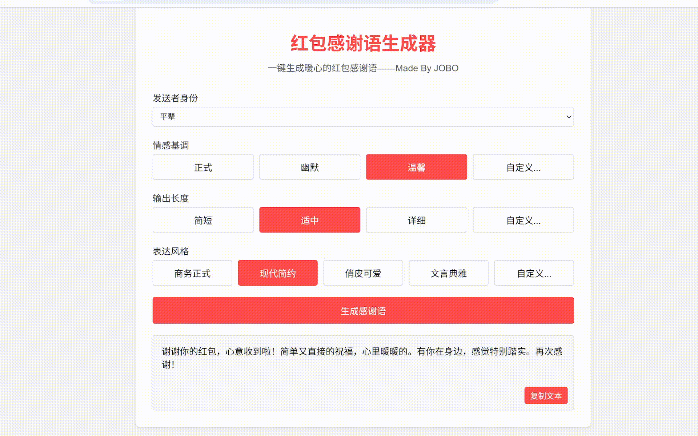

# 红包感谢语生成器

这是一个基于GLM-4大模型的红包感谢语生成器，可以帮助用户快速生成合适的红包感谢语。在线体验：[点击这里](#)

## 功能特点

- 支持选择预设场景（平辈、长辈等）
- 支持自定义场景描述
- 可调节情感基调（正式、幽默、温馨）
- 可设置输出长度（简短、适中、详细）
- 支持多种表达风格（商务正式、现代简约等）
- 接入GLM-4大模型API，生成智能且自然的感谢语

## 技术栈

- 前端：HTML5, CSS3, JavaScript
- 后端：Python + Flask
- AI模型：智谱GLM-4 API

## 预览效果



## 部署说明

1. 克隆项目：
```bash
git clone https://github.com/yourusername/thanks-hongbao.git
cd thanks-hongbao
```

2. 安装依赖：
```bash
pip install -r requirements.txt
```

3. 配置环境变量：
   - 在项目根目录创建.env文件
   - 在[智谱AI开放平台](https://open.bigmodel.cn/)注册账号并获取API密钥
   - 在.env文件中设置GLM_API_KEY环境变量：
     ```
     GLM_API_KEY=your_api_key_here
     ```

4. 启动服务：
```bash
python app.py
```

服务启动后访问 http://localhost:5000 即可使用


## 贡献指南

欢迎提交Issue和Pull Request！

1. Fork本仓库
2. 创建您的特性分支 (git checkout -b feature/AmazingFeature)
3. 提交您的更改 (git commit -m 'Add some AmazingFeature')
4. 推送到分支 (git push origin feature/AmazingFeature)
5. 开启一个Pull Request


